

  

<h1 align="center">Análisis Predictivo y Caracterización de Serie de Tiempo mediante Modelado Estocástico SARIMAX aplicado a Starbucks Corporation (SBUX)</h1>

<h3 align="center">UNIVERSIDAD NACIONAL DE INGENIERÍA</h3>
<h4 align="center">Facultad de Ingeniería Económica, Estadística y Ciencias Sociales</h4>

---

<h3 align="center"><strong>Información del Documento</strong></h3>
<ul>
  <li><strong>Autor:</strong> Frankli Zeña Zeña</li>
  <li><strong>Institución:</strong> Universidad Nacional de Ingeniería (UNI)</li>
  <li><strong>Fecha de Creación:</strong> 13 de febrero de 2026</li>
  <li><strong>Última Edición:</strong> 16 de febrero de 2026</li>
  <li><strong>Repositorio Asociado:</strong> <code>research-time-series-sbux/</code></li>
</ul>

---

## **Índice**
- [**Índice**](#índice)
- [**1. Introducción y Objetivos**](#1-introducción-y-objetivos)
- [**2. Marco Institucional y Corporativo: Starbucks Corporation**](#2-marco-institucional-y-corporativo-starbucks-corporation)
  - [**2.1. Identidad Corporativa y Modelo de Negocio**](#21-identidad-corporativa-y-modelo-de-negocio)
  - [**2.2. Reseña Histórica y Crecimiento Estructural (1971-Presente)**](#22-reseña-histórica-y-crecimiento-estructural-1971-presente)
  - [**2.3. Dinámica de Liderazgo y el "Choque Estructural" (2022-Presente)**](#23-dinámica-de-liderazgo-y-el-choque-estructural-2022-presente)
  - [**2.4. Posicionamiento, Competencia y Matriz de Riesgos**](#24-posicionamiento-competencia-y-matriz-de-riesgos)
  - [**2.5. Arquitectura de Generación de Valor y Posicionamiento Estratégico Estructural**](#25-arquitectura-de-generación-de-valor-y-posicionamiento-estratégico-estructural)
    - [**2.5.1. Núcleo Económico del Negocio (Value Drivers Estructurales)**](#251-núcleo-económico-del-negocio-value-drivers-estructurales)
    - [**2.5.2. Posicionamiento Competitivo en la Industria**](#252-posicionamiento-competitivo-en-la-industria)
    - [**2.5.3. Implicancias para el Modelado Econométrico**](#253-implicancias-para-el-modelado-econométrico)
- [**3. Marco Teórico y Metodológico**](#3-marco-teórico-y-metodológico)
  - [**3.1. Adquisición, Preprocesamiento y Estadística Descriptiva**](#31-adquisición-preprocesamiento-y-estadística-descriptiva)
  - [**3.2. Descomposición Clásica de la Serie de Tiempo**](#32-descomposición-clásica-de-la-serie-de-tiempo)
  - [**3.3. Estacionariedad y Pruebas de Raíz Unitaria**](#33-estacionariedad-y-pruebas-de-raíz-unitaria)
  - [**3.4. Identificación del Modelo: Funciones de Autocorrelación (ACF y PACF)**](#34-identificación-del-modelo-funciones-de-autocorrelación-acf-y-pacf)
  - [**3.5. Estimación del Modelo SARIMAX**](#35-estimación-del-modelo-sarimax)
  - [**3.6. Partición de Datos y Evaluación Predictiva**](#36-partición-de-datos-y-evaluación-predictiva)
  - [**3.7. Optimización y Selección de Hiperparámetros (Minimización del Error)**](#37-optimización-y-selección-de-hiperparámetros-minimización-del-error)
- [**4. Resultados Empíricos y Desarrollo del Análisis Estocástico**](#4-resultados-empíricos-y-desarrollo-del-análisis-estocástico)
  - [**4.1. Configuración de la Muestra y Detección de Anomalías (EDA)**](#41-configuración-de-la-muestra-y-detección-de-anomalías-eda)
      - [Ingresos (Revenue)](#ingresos-revenue)
      - [Utilidad Operativa (Operating Income)](#utilidad-operativa-operating-income)
      - [Utilidad Neta (Net Income)](#utilidad-neta-net-income)
      - [Resumen por etapas](#resumen-por-etapas)
  - [**4.2. Análisis Exploratorio y Estacionariedad**](#42-análisis-exploratorio-y-estacionariedad)
    - [4.2.1. Estadísticas Descriptivas de la Serie Original](#421-estadísticas-descriptivas-de-la-serie-original)
    - [4.2.2. Análisis de Raíz Unitaria y la Transformación Dual](#422-análisis-de-raíz-unitaria-y-la-transformación-dual)
  - [**4.3. Identificación Estructural: Correlogramas**](#43-identificación-estructural-correlogramas)
  - [**4.4. Optimización Paramétrica y Selección de Características (Feature Selection)**](#44-optimización-paramétrica-y-selección-de-características-feature-selection)
    - [**Inferencia sobre Variables Exógenas y Selección de Características (Feature Selection)**](#inferencia-sobre-variables-exógenas-y-selección-de-características-feature-selection)
    - [Modelo SARIMAX Final: Estimación e Inferencia](#modelo-sarimax-final-estimación-e-inferencia)
  - [**4.5. Pronóstico Tradicional (Multi-Step Forecasting) y Limitaciones Estructurales**](#45-pronóstico-tradicional-multi-step-forecasting-y-limitaciones-estructurales)
  - [**4.6. Simulación Predictiva Dinámica (Walk-Forward Validation)**](#46-simulación-predictiva-dinámica-walk-forward-validation)
  - [**4.7. Evaluación de Rendimiento y Métricas de Error Definitivas**](#47-evaluación-de-rendimiento-y-métricas-de-error-definitivas)
- [**5. Conclusiones y Recomendaciones**](#5-conclusiones-y-recomendaciones)
- [**6. Anexos y Referencias**](#6-anexos-y-referencias)
  - [**6.1. Anexos y Recursos Computacionales**](#61-anexos-y-recursos-computacionales)
  - [**6.2. Referencias Bibliográficas**](#62-referencias-bibliográficas)

---

## **1. Introducción y Objetivos**
El presente informe técnico desarrolla un estudio estadístico temporal (econométrico) exhaustivo sobre la serie de precios y retornos de **Starbucks Corporation (Ticker: SBUX)**. En el ámbito de la Ingeniería, la comprensión de la dinámica de los activos financieros exige ir más allá del análisis técnico tradicional; requiere la integración de la salud financiera de la empresa y el impacto psicológico de los shocks externos (noticias, cambios de directiva, crisis geopolíticas).

Para lograr esto, se emplea la metodología **SARIMAX** (Seasonal AutoRegressive Integrated Moving Average with eXogenous variables). Este enfoque estocástico permite descomponer la serie en sus componentes de tendencia y estacionalidad, mientras simultáneamente mide el impacto paramétrico de variables explicativas cuantitativas (Estados Financieros) y cualitativas (Variables Dummy de Intervención).

**Objetivos del Proyecto:**
* **General:** Desarrollar un modelo predictivo robusto para la cotización de SBUX integrando análisis fundamental (ratios financieros) y cualitativo (eventos de mercado).
* **Específicos:**
  1. Identificar y modelar la estructura estacional ($s$) y el orden de integración ($d$) de la serie histórica.
  2. Cuantificar el impacto de shocks estructurales (Ej. cambios de CEO) y presiones competitivas mediante el uso de funciones de intervención (Pulse, Step, Window).
  3. Ejecutar una validación predictiva *Walk-Forward* para minimizar el sesgo y evaluar el desempeño mediante métricas de error estándar (RMSE, MAPE). (IDEAL)

---

## **2. Marco Institucional y Corporativo: Starbucks Corporation**
> Extracto: [00_sbux_history_timelines.ipynb](../notebooks/00_sbux_history_timelines.ipynb)
> 
El análisis estocástico de un activo financiero carece de validez si se aísla de su realidad corporativa. La cotización de Starbucks Corporation (Ticker: SBUX) no es solo el resultado de la oferta y la demanda algorítmica, sino el reflejo de su evolución histórica, la estabilidad de su cúpula directiva y su capacidad para mitigar riesgos sistémicos. 

---

---

### **2.1. Identidad Corporativa y Modelo de Negocio**

Starbucks no es únicamente un distribuidor de café; es el principal tostador y minorista de cafés de especialidad a nivel global. Su modelo de negocio se sostiene sobre el concepto sociológico del **"Tercer Lugar"** (Third Place): un espacio de transición cálido, seguro y acogedor entre el hogar y el lugar de trabajo. 

### **2.2. Reseña Histórica y Crecimiento Estructural (1971-Presente)**
La consolidación de Starbucks como barómetro del consumo global es el resultado de hitos estratégicos que impulsaron un crecimiento exponencial en su infraestructura operativa:
* **1971 a 1987 - Los Orígenes y la Fusión:** La compañía inicia con una sola tienda en el Pike Place Market de Seattle, dedicada a la venta de granos. Tras su viaje a Milán (1983), Howard Schultz identifica el potencial de la cultura "espresso". En 1987, respaldado por inversores, Schultz adquiere los activos de Starbucks (fusionándola con su empresa *Il Giornale*), operando apenas 17 tiendas en ese momento.
* **1990s - Expansión y Oferta Pública (IPO):** La empresa consolida su estructura laboral al ser pionera en ofrecer cobertura médica a empleados a tiempo parcial. En 1992, sale a bolsa (IPO), catalizando una agresiva expansión internacional que inicia en Japón (1996). Para el año 2000, la corporación ya superaba las 3,500 tiendas.
* **2020s - Resiliencia y Reinventos:** Ante la pandemia de COVID-19, Starbucks acelera su transformación digital (Drive-Thru, Pick-up) y lanza iniciativas de sostenibilidad ("Resource Positive"). A pesar de las contracciones macroeconómicas, la compañía logra escalar su operación global de manera ininterrumpida.

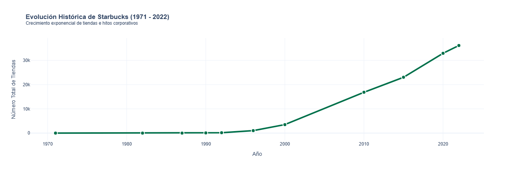

> **Análisis Visual de la Expansión:**
> Tal como se observa en la métrica de apertura de sucursales, la compañía pasó de ser un negocio local a un imperio multinacional con **más de 36,160 tiendas a inicios de 2022**, lo que explica la alta capitalización bursátil (Large Cap) que sostiene hoy la acción.

### **2.3. Dinámica de Liderazgo y el "Choque Estructural" (2022-Presente)**
En la modelización financiera, la "calidad de gestión" (Management Quality) es un factor crítico para la prima de riesgo de una empresa. Históricamente, Starbucks gozó de estabilidad bajo la visión prolongada de Howard Schultz. Sin embargo, el periodo reciente se ha caracterizado por una alta fricción directiva.

Tras la salida de Kevin Johnson en 2022 (quien lideró la era de transformación digital), la compañía enfrentó una turbulencia administrativa marcada por el retorno interino de Schultz, presiones de sindicalización laboral y el breve mandato de Laxman Narasimhan (2023-2024), el cual coincidió con un estancamiento en las ventas comparables globales.

**La Era de Brian Niccol (Agosto 2024):**
Para revertir la destrucción de valor bursátil, la junta directiva ejecutó un **choque estructural** agresivo nombrando a Brian Niccol (ex-CEO de Chipotle) al mando. Su mandato busca implementar la estrategia *"Back to Starbucks"*, orientada a desarmar ineficiencias operativas crónicas, restaurar la cultura artesanal del café, simplificar menús y frenar la fatiga de precios del consumidor en mercados críticos (EE. UU. y China).

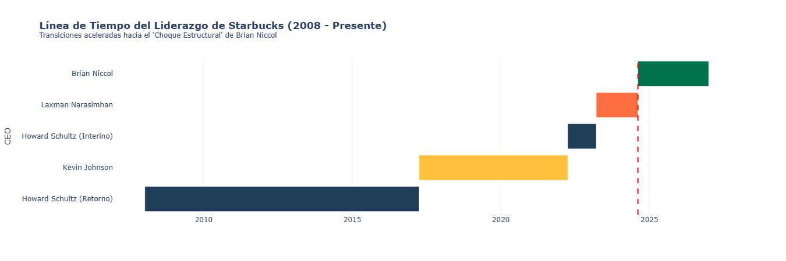

> **Línea de Tiempo del Liderazgo:**
> El siguiente diagrama ilustra la compresión en los tiempos de gestión reciente. Esta inestabilidad directiva justifica metodológicamente la inclusión de la variable de intervención `choque_estructural` en nuestro modelo estadístico en estudio, con el fin de cuantificar si el mercado premió o castigó estos cambios de timón.
> 
### **2.4. Posicionamiento, Competencia y Matriz de Riesgos**
Starbucks cotiza en el sector de **Consumo Cíclico (Consumer Discretionary)**. Su valoración no es inmune a los ciclos macroeconómicos; por el contrario, actúa como un termómetro del ingreso disponible de las familias. 

Si bien cualitativamente la empresa enfrenta múltiples frentes de riesgo (desde inflación hasta guerras de precios con QSRs como McDonald's y rivales asiáticos como Luckin Coffee), **el mercado bursátil no penaliza todos estos factores con la misma intensidad diaria.** Para aterrizar este perfil de riesgo corporativo hacia un enfoque cuantitativo, se estructuró una **Matriz de Sensibilidad Exógena** basada en los hallazgos paramétricos ($P\text{-valor}$) del modelo SARIMAX desarrollado en este estudio:

1. **Riesgos de Impacto Fulminante (Alta Sensibilidad):** Eventos como crisis reputacionales masivas (`shock_extremo`, $P=0.000$) y las rupturas inflacionarias en la cadena de suministros (`shock_costos`, $P=0.000$) generan correcciones destructivas e inmediatas en la cotización. Asimismo, el mercado reacciona con euforia estadística a los cambios de cúpula directiva y a los reportes trimestrales (`earnings`).
2. **Riesgos de Asimilación Gradual (Baja Sensibilidad Diaria):** Factores estructurales como el riesgo país global (`riesgo_pais`, $P=0.711$) o variaciones interpoladas en ratios financieros (Margen/Revenue) son descontados por los inversores a largo plazo, careciendo de impacto estadístico como "shocks" diarios que alteren la varianza del modelo a corto plazo.

> **Perfil Paramétrico de Riesgos:**
> El siguiente gráfico de radar sintetiza cómo las amenazas y fortalezas institucionales descritas en este marco se traducen matemáticamente en la volatilidad diaria de la acción, sirviendo como puente entre la teoría corporativa y la inferencia estadística de la Sección 4.

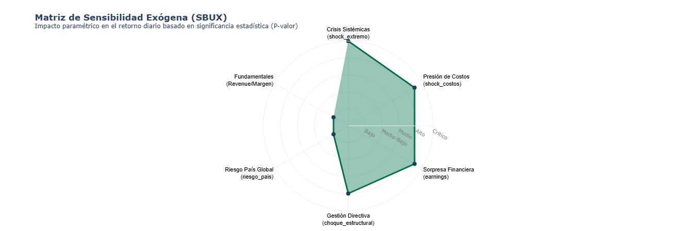

### **2.5. Arquitectura de Generación de Valor y Posicionamiento Estratégico Estructural**

El comportamiento bursátil de [Starbucks](anexos/anexo_sbux.md) no puede explicarse únicamente desde su identidad de marca o sus eventos corporativos recientes, sino desde la estructura económica que sostiene su capacidad de generación de flujos de caja recurrentes. 

Desde la perspectiva de la ingeniería, la empresa genera valor al transformar un *commodity* altamente volátil (el grano de café Arábica) en una experiencia *premium*. Esta estrategia de diferenciación le otorga poder de fijación de precios (Pricing Power) y fidelización, respaldada por un ecosistema digital masivo (Starbucks Rewards) que funciona, en la práctica, como un motor de liquidez anticipada a través de las recargas de saldos de sus clientes.

#### **2.5.1. Núcleo Económico del Negocio (Value Drivers Estructurales)**

El sistema de generación de valor de Starbucks descansa sobre tres pilares interdependientes:

**1. Modelo de Margen Premium con Alta Rotación**

La compañía transforma un commodity volátil (café arábica) en un producto de diferenciación experiencial.  
Este proceso permite:

- Mantener márgenes superiores al promedio del segmento QSR.
- Ejercer *pricing power* en entornos inflacionarios.
- Sostener elasticidades-precio relativamente bajas en mercados desarrollados.

En términos financieros, este componente explica la resiliencia parcial del margen operativo incluso en ciclos contractivos.

**2. Ecosistema Digital y Financiamiento Implícito (Flywheel Financiero)**

El programa Starbucks Rewards opera como:

- Sistema de fidelización conductual.
- Plataforma de datos predictivos de consumo.
- Mecanismo de financiamiento operativo sin costo vía recargas anticipadas (float).

Este mecanismo reduce la volatilidad estructural de ingresos y fortalece la recurrencia del flujo de caja operativo, aspecto clave para la valoración descontada de la acción.

**3. Escala Global y Diversificación Geográfica**

Con presencia consolidada en América del Norte y expansión estratégica en Asia, la compañía:

- Dilute costos fijos a gran escala.
- Optimiza economías logísticas.
- Mitiga riesgo idiosincrático regional mediante diversificación.

Desde el punto de vista de estructura industrial, la escala constituye una barrera de entrada significativa frente a competidores emergentes.

#### **2.5.2. Posicionamiento Competitivo en la Industria**

Dentro del sector de Consumo Cíclico, Starbucks ocupa una posición estratégica intermedia:

- No compite exclusivamente por precio como :contentReference[oaicite:1]{index=1}.
- No se posiciona como cafetería artesanal local de nicho.
- No opera bajo subsidios agresivos de expansión como :contentReference[oaicite:2]{index=2}.

Su estructura puede clasificarse como:

> **Premium Estandarizado Globalmente**

Este posicionamiento implica:

- Altas barreras de entrada (marca + escala + digitalización).
- Rivalidad competitiva elevada pero segmentada.
- Poder de negociación medio-alto frente a proveedores debido a volumen.

#### **2.5.3. Implicancias para el Modelado Econométrico**

La arquitectura estructural descrita tiene consecuencias directas sobre la dinámica estocástica observada en la serie temporal:

1. La empresa presenta resiliencia de mediano plazo, lo que favorece procesos con reversión parcial tras shocks extremos.
2. Los eventos reputacionales o de gestión generan impactos abruptos debido a la sensibilidad del mercado hacia activos con fuerte componente intangible.
3. La estacionalidad mensual detectada (21 días hábiles) puede asociarse a ciclos institucionales de rebalanceo y comportamiento de fondos que ponderan activos Large Cap defensivos dentro del consumo discrecional.

En consecuencia, la inclusión de:

- Variables de intervención tipo *Pulse* y *Step*,
- Componentes estacionales,
- Y dummies asociadas a cambios estructurales,

no solo responde a un criterio estadístico, sino a fundamentos microeconómicos coherentes con la posición competitiva de la firma.

Esta integración fortalece la consistencia entre la teoría económica industrial y la especificación formal del modelo SARIMAX desarrollado en la Sección 4.
___

## **3. Marco Teórico y Metodológico**

El desarrollo de este estudio sigue un flujo de trabajo cuantitativo riguroso, estructurado en etapas de preprocesamiento, identificación, estimación y evaluación. A continuación, se detallan los fundamentos estadísticos aplicados a la serie de Starbucks (SBUX).

### **3.1. Adquisición, Preprocesamiento y Estadística Descriptiva**

La serie endógena $y_t$ representa el precio de Cierre Ajustado (*Adj Close*) de SBUX. Dado que los mercados financieros no operan fines de semana ni feriados, la serie original presenta brechas temporales (valores nulos). 
* **Imputación por Forward Fill:** Para mantener la continuidad estricta del tiempo sin inventar datos futuros, se aplicó una imputación de último valor acarreado. Matemáticamente:
  $$y_t = y_{t-1} \quad \text{si } y_t \text{ es nulo}$$
* **Análisis Descriptivo:** Antes de modelar, se calcularon los momentos estadísticos fundamentales de la distribución de precios: la media ($\mu$), varianza ($\sigma^2$), asimetría (Skewness) y curtosis. En finanzas, una alta curtosis (distribución leptocúrtica) indica una mayor probabilidad de eventos extremos ("colas gordas"), lo cual justifica la inclusión de variables cualitativas (noticias) para explicar dichos picos.

### **3.2. Descomposición Clásica de la Serie de Tiempo**
> 
Para aislar la señal del ruido, la serie empírica fue separada en sus tres componentes inobservables mediante un modelo aditivo (asumiendo que la varianza de la estacionalidad no crece exponencialmente con la tendencia). La ecuación de descomposición se define como:
$$y_t = T_t + S_t + R_t$$
Donde:
* $T_t$: **Tendencia (Trend)**, la dirección a largo plazo del activo.
* $S_t$: **Estacionalidad (Seasonality)**, patrones cíclicos de longitud fija (ej. trimestres fiscales).
* $R_t$: **Ruido/Residuo (Residual)**, la variación aleatoria no explicada por el modelo.

### **3.3. Estacionariedad y Pruebas de Raíz Unitaria**
> Extractos: [03_stationarity_and_prep.ipynb](../notebooks/03_stationarity_and_prep.ipynb) & [03.1_stationarity_and_prep.ipynb](../notebooks/03.1_stationarity_and_prep.ipynb)

Un requisito insoslayable para los modelos autorregresivos es que la serie sea **estacionaria**; es decir, que su media y varianza sean constantes en el tiempo y no dependan del momento $t$ en que se observan.
Para comprobar empíricamente la presencia de una tendencia estocástica, se empleó la **Prueba de Dickey-Fuller Aumentada (ADF)**, cuya regresión subyacente es:
$$\Delta y_t = \alpha + \beta t + \gamma y_{t-1} + \sum_{i=1}^{p} \delta_i \Delta y_{t-i} + \epsilon_t$$
* **Hipótesis Nula ($H_0$):** $\gamma = 0$ (La serie tiene una raíz unitaria y es no estacionaria).
* **Hipótesis Alternativa ($H_1$):** $\gamma < 0$ (La serie es estacionaria).

Al observar un p-valor $> 0.05$ en la serie original de Starbucks, se procedió a aplicar un **Operador de Diferencia ($d$)** para estabilizar la media:
$$\nabla y_t = y_t - y_{t-1}$$
Del mismo modo, al detectar patrones estacionales, se aplicó una **Diferencia Estacional ($D$)** de orden $s$ (donde $s$ es la frecuencia del ciclo):
$$\nabla_s y_t = y_t - y_{t-s}$$

### **3.4. Identificación del Modelo: Funciones de Autocorrelación (ACF y PACF)**

Con la serie estacionaria, se identificaron los hiperparámetros del modelo (rezagos) analizando los correlogramas.
1. **ACF (Autocorrelation Function):** Mide la correlación lineal de Pearson entre la serie y sus propios valores pasados $y_{t-k}$. Los cortes abruptos en el ACF determinan el componente de Media Móvil ($q$ y $Q$).
2. **PACF (Partial Autocorrelation Function):** Mide la correlación entre $y_t$ y $y_{t-k}$ eliminando el efecto de los rezagos intermedios. Sus cortes determinan el componente Autorregresivo ($p$ y $P$).

### **3.5. Estimación del Modelo SARIMAX**

Integrando los componentes anteriores y añadiendo la matriz de características macroeconómicas e intervenciones ($X_t$), el modelo de clase **SARIMAX $(p,d,q) \times (P,D,Q)_s$** se define matemáticamente mediante el operador de rezago $L$ ($L^k y_t = y_{t-k}$):

$$\phi_p(L) \Phi_P(L^s) (1-L)^d (1-L^s)^D y_t = \beta X_t + \theta_q(L) \Theta_Q(L^s) \epsilon_t$$

Donde:
* $\phi_p$ y $\Phi_P$: Polinomios autorregresivos regular y estacional.
* $\theta_q$ y $\Theta_Q$: Polinomios de media móvil regular y estacional.
* $\beta$: Vector de coeficientes para las variables exógenas (Ratios financieros y eventos como *Choques Competitivos*).
* $\epsilon_t$: Término de error asumiendo ruido blanco ($\mu = 0, \sigma^2$ constante).

### **3.6. Partición de Datos y Evaluación Predictiva**
Dada la dependencia temporal estricta de los datos financieros, no es válido realizar particiones aleatorias (*Cross-Validation* estándar). Se dividió el dataset cronológicamente en:
* **Conjunto de Entrenamiento (Train):** 80% al 85% de los datos más antiguos, utilizados para ajustar los coeficientes $\phi, \theta$ y $\beta$.
* **Conjunto de Validación (Test):** 15% al 20% más reciente, reservado como entorno de "datos no vistos" para la proyección y contraste de la realidad frente al pronóstico de la métrica de Cierre.

### **3.7. Optimización y Selección de Hiperparámetros (Minimización del Error)**
La selección final del modelo no dependió de un solo intento. Se aplicó una búsqueda iterativa probando múltiples combinaciones SARIMAX. El criterio de selección se basó en minimizar el **Error Cuadrático Medio (MSE)** en el conjunto de validación, el cual penaliza severamente los pronósticos atípicos:
$$MSE = \frac{1}{n} \sum_{i=1}^{n} (y_i - \hat{y}_i)^2$$
El modelo óptimo seleccionado fue aquel que, tras pasar las pruebas de normalidad de residuos y test de Ljung-Box (ausencia de autocorrelación en los errores), arrojó el MSE y el Criterio de Información de Akaike (AIC) más bajos, validando su robustez predictiva.

---

## **4. Resultados Empíricos y Desarrollo del Análisis Estocástico**
> Extracto: [01_data_acquisition_cleaning.ipynb](../notebooks/01_data_acquisition_cleaning.ipynb)
> 
En esta sección veremos los resultados obtenidos tras la aplicación secuencial del pipeline de modelado de series temporales sobre la cotización de Starbucks Corporation (SBUX). El análisis abarca desde el tratamiento de la microestructura de los datos (volumen) hasta la evaluación paramétrica y simulación predictiva *Walk-Forward*, evaluando rigurosamente el impacto de los factores exógenos.

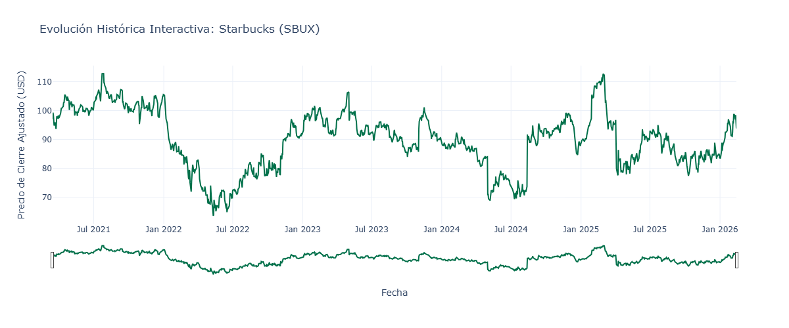

### **4.1. Configuración de la Muestra y Detección de Anomalías (EDA)**
> Extracto: [02_eda_and_news_analysis.ipynb](../notebooks/02_eda_and_news_analysis.ipynb)

La base de datos analizada comprende el periodo del **15 de marzo de 2021 al 13 de febrero de 2026**, totalizando un vector de 1,225 observaciones bursátiles diarias. 

Dado que la serie de tiempo financiera presenta interrupciones naturales (fines de semana y feriados bursátiles), se aplicó una técnica de **Imputación Forward Fill (Último Valor Observado)**. Esta decisión metodológica garantiza la equidistancia temporal estricta requerida por los modelos autorregresivos, mitigando el riesgo de "fuga de datos" (Data Leakage) inherente a las interpolaciones lineales retrospectivas.

**Análisis de la Microestructura de Volumen:**
 Mediante el contraste del volumen diario contra una Media Móvil Simple de 20 periodos, el algoritmo detectó **43 anomalías estadísticas de volumen**. 

 
 | Date       | # Adj Close          | # Volume   | # Vol_Avg_20 | # Vol_Anomaly | # Log_Return                 |
|:-----------|:---------------------|:-----------|:-------------|:--------------|:-----------------------------|
| 2021-03-15 | 97.09121704101562    | 7107300    | 6295740.0    | False         | 0.010059511459584404         |
| 2021-03-16 | 99.26663208007812    | 11376200   | 6618145.0    | False         | 0.02215856467326595          |
| 2021-03-17 | 98.4820556640625     | 10128400   | 6837875.0    | False         | -0.007935127578150918        |
| 2021-03-18 | 95.95001983642578    | 7813400    | 7023610.0    | False         | -0.02604692639181637         |
| 2021-03-19 | 94.80880737304688    | 21452000   | 7889765.0    | True          | -0.011965119466228448        |
| ...        | ...                  | ...        | ...          | ...           | ...                           |

`La tabla completa contiene 1237 registros`

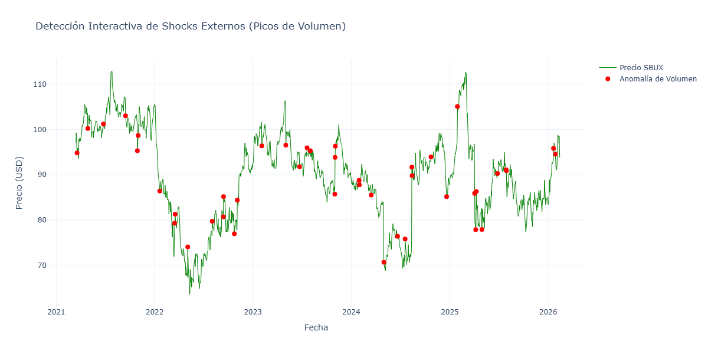

> 💡 **Interpretación:** La concentración de estas anomalías coincide cronológicamente con periodos de alta tensión para la firma (e.g., el ingreso de fondos activistas como Elliott Management y la transición de CEOs). Esto demuestra empíricamente que la acción de SBUX no fluctúa por mero "ruido estocástico", sino por reasignaciones masivas de capital institucional ante noticias clave.

Tras la identificación de las anomalías en la serie, se realizó una búsqueda exhaustiva de eventos históricos ocurridos en las fechas correspondientes a dichos valores atípicos. Esta investigación permitió contextualizar los shocks y su posible impacto en el mercado. Todos los eventos identificados y sus descripciones detalladas se encuentran documentados en:  [`anexos/anexo_eventos.md`](anexos/anexo_eventos.md).

**Análisis Financiero Complementario:**

Para complementar el análisis de anomalías y eventos en la serie financiera, se realizó una extracción y evaluación de los principales estados financieros trimestrales de la empresa. Este análisis permite entender la evolución subyacente del negocio y su impacto potencial en el comportamiento de la serie temporal estudiada.

El paquete `stockdex` proporciona herramientas para la extraccion de estados financieros de ``Macrotrends`` (Página que alberga los estados financieros de trimestral y anual de empresas en bolsa, similar a Yahoo Finance); sin embargo, para el desarrollo del modelo se priorizan los indicadores que más influyen en la acción:

- **Revenue (Ventas Totales):** Indica el volumen de ventas de la empresa.
- **Operating Income (Ingreso Operativo):** Representa la utilidad tras costos directos.
- **Margen Operativo:** Nueva característica que refleja la eficiencia operativa en cada periodo.

| Fecha       | Revenue | Operating Income | Net Income |
|-------------|---------|------------------|------------|
| 2025-12-31  | 9915.1  | 890.8            | 293.3      |
| 2025-09-30  | 9569.0  | 278.3            | 133.1      |
| 2025-06-30  | 9456.0  | 935.6            | 558.3      |
| 2025-03-31  | 8761.6  | 601.0            | 384.2      |
| 2024-12-31  | 9397.8  | 1121.7           | 780.8      |
| ...         | ...     | ...              | ...        |

`Se recogieron los Estados Financieros de todos los trimestres completos de los años 2020 al 2025`
##### Ingresos (Revenue)

- **Tendencia general:** crecimiento estructural.
- En 2020, fuerte impacto en el segundo trimestre con caída notable a aproximadamente 4,222 millones, atribuible a la pandemia.
- Entre 2021 y 2023, se observa una recuperación sólida y crecimiento sostenido.
- En 2024 y 2025, los ingresos se estabilizan alrededor de 9,000 a 9,900 millones por trimestre.
- En resumen, se pasa de niveles de 6,000–7,000 millones trimestrales a niveles cercanos a 9,500–10,000, evidenciando un crecimiento claro post-COVID y una estabilización reciente.

##### Utilidad Operativa (Operating Income)

- Mayor volatilidad respecto a los ingresos.
- Pérdida operativa destacada en el segundo trimestre de 2020 (-703 millones).
- Fuerte recuperación en 2021–2023 con picos entre 1,500 y 1,700 millones.
- En 2025 se observa una ligera desaceleración comparado con los máximos recientes.
- El margen operativo mejora significativamente tras la pandemia, aunque se detecta compresión en 2025.

##### Utilidad Neta (Net Income)

- Impacto severo en 2020, incluyendo utilidad negativa en el segundo trimestre.
- Recuperación sólida entre 2021 y 2023, con trimestres superando 1,100–1,200 millones.
- En 2024–2025, mantiene resultados positivos pero con mayor variabilidad.
- La empresa vuelve a niveles sólidos de rentabilidad, aunque 2025 no alcanza los picos de 2023.

##### Resumen por etapas

- **2020 – Impacto COVID:** fuerte caída en ingresos, pérdidas operativas y alta volatilidad.
- **2021–2023 – Recuperación y expansión:** crecimiento constante, mejora de márgenes y utilidades en máximos históricos.
- **2024–2025 – Estabilización:** ingresos elevados pero crecimiento más lento, márgenes presionados y rentabilidad estable.

> ##### Conclusión general
> 
> Durante los últimos cinco años, Starbucks muestra una recuperación exitosa post-pandemia, con crecimiento estructural en ingresos y rentabilidad sólida. Sin embargo, se observan señales recientes de desaceleración en márgenes, lo que podría anticipar un ajuste en la dinámica financiera futura.

**Introducción y cálculo del Margen Operativo:**

Para profundizar en la eficiencia operativa, se introduce la característica financiera **Margen Operativo**, definida como la proporción del ingreso operativo respecto a los ingresos totales:

\[
\text{Margen Operativo} = \frac{\text{Operating Income}}{\text{Revenue}}
\]

Expresado en porcentaje:

\[
\text{Margen Operativo (\%)} = \text{Margen Operativo} \times 100
\]

Esta métrica es crucial porque indica qué porcentaje de las ventas queda como beneficio operativo después de cubrir costos directos, reflejando la eficiencia en la gestión operativa y el impacto sobre la rentabilidad.
| Fecha      | Revenue | Operating Income | Net Income | Margen Operativo | Margen Operativo (%) |
|:-----------|--------:|-----------------:|-----------:|-----------------:|---------------------:|
| 2020-03-31 | 5995.7  | 487.4004         | 328.4      | 0.0813           | 8.13%                |
| 2020-06-30 | 4222.1  | -703.8999        | -678.4     | -0.1667          | -16.67%              |
| 2020-09-30 | 6203.1  | 558.3989         | 392.6      | 0.0900           | 9.00%                |
| 2020-12-31 | 6749.4  | 913.4995         | 622.2      | 0.1353           | 13.53%               |
| 2021-03-31 | 6668.0  | 987.6001         | 659.4      | 0.1481           | 14.81%               |
| ...        | ...     | ...              | ...        | ...              | ...                  |

Este análisis financiero inicial fundamenta la selección de variables para modelar la serie, contribuyendo a mejorar la precisión y la interpretación del modelo.

**División de Datos: Entrenamiento y Validación**

Para asegurar la robustez del modelo SARIMAX y evaluar su capacidad de generalización, la serie temporal ajustada (`Adj Close`) y la matriz de variables exógenas fueron divididas en dos subconjuntos:

1. **Datos de Entrenamiento:**  
   - Comprenden aproximadamente el 80% de la serie histórica disponible.  
   - Incluyen los primeros 980 registros (de un total de 1225 observaciones).  
   - Este conjunto se utilizó para estimar los parámetros del modelo, ajustar los coeficientes ARIMA/SARIMA y evaluar la significancia de las variables exógenas.  

2. **Datos de Validación:**  
   - Comprenden el 20% restante de la serie (245 registros).  
   - Se emplean para evaluar el desempeño predictivo del modelo sobre datos no vistos durante el ajuste.  
   - Permite calcular métricas de error como MSE, RMSE, MAE y MAPE, así como verificar la capacidad de generalización del modelo ante shocks no incluidos en el entrenamiento.  

> **Justificación metodológica:**  
> La separación temporal es fundamental en modelos de series de tiempo, dado que los datos diarios de mercado presentan alta autocorrelación y posibles estructuras estacionales. Entrenar el modelo sobre la totalidad de la serie puede generar **sobreajuste**, donde el modelo "memoriza" patrones históricos pero falla en predecir eventos futuros.  
>
> Al utilizar un conjunto de validación separado, se obtiene una estimación objetiva de la precisión y confiabilidad de las predicciones, permitiendo ajustar la complejidad del modelo y la selección de variables exógenas antes de cualquier implementación práctica.  

**Visualización esquemática:**

| Conjunto           | Observaciones | Porcentaje | Uso principal |
|-------------------|---------------|------------|---------------|
| Entrenamiento      | 980           | 80%        | Ajuste de parámetros, estimación de coeficientes y pruebas de significancia. |
| Validación         | 245           | 20%        | Evaluación predictiva y cálculo de métricas de desempeño. |

---

### **4.2. Análisis Exploratorio y Estacionariedad**
> Extractos: [03_stationarity_and_prep.ipynb](../notebooks/03_stationarity_and_prep.ipynb) & [03.1_stationarity_and_prep.ipynb](../notebooks/03.1_stationarity_and_prep.ipynb)

#### 4.2.1. Estadísticas Descriptivas de la Serie Original

Antes de analizar los modelos y transformaciones en la sección 4.2, es útil examinar las **estadísticas descriptivas de la serie original de precios y los retornos logarítmicos**.

- La serie de precios muestra variabilidad inherente a los movimientos del mercado, reflejando cambios diarios y posibles picos por eventos específicos.
- Los **retornos logarítmicos** presentan las siguientes métricas clave:

| Métrica | Valor |
|---------|-------|
| Conteo (count) | 1237 |
| Media (mean) | -0.000020 |
| Desviación estándar (std) | 0.019517 |
| Mínimo (min) | -0.172896 |
| Percentil 25 (25%) | -0.009325 |
| Mediana (50%) | -0.000086 |
| Percentil 75 (75%) | 0.009154 |
| Máximo (max) | 0.219111 |

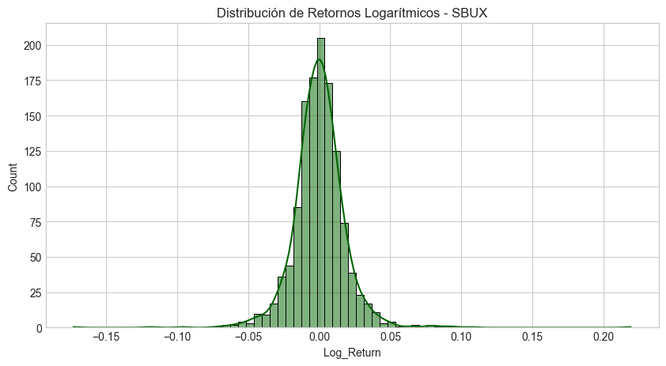

- La media cercana a cero indica que **no hay tendencia significativa** en los retornos diarios.
- La **desviación estándar** muestra que la volatilidad diaria promedio es aproximadamente 1.95%.
- La **curtosis** elevada sugiere la presencia de valores extremos o shocks de mercado, típicos en series financieras.
- Dado que los retornos logarítmicos siguen una **distribución aproximadamente normal**, es razonable aplicar métodos estadísticos paramétricos para análisis posteriores, como pruebas de hipótesis o modelos de regresión.

> Esta evaluación proporciona un marco de referencia antes de aplicar las transformaciones o modelizaciones descritas en la sección 4.2.2.

#### 4.2.2. Análisis de Raíz Unitaria y la Transformación Dual

La convergencia matemática de cualquier modelo de la familia ARIMA exige la **estacionariedad** del proceso generador de datos. Para evaluarla, se ejecutó la Prueba de Dickey-Fuller Aumentada (ADF) contrastando dos enfoques analíticos:

**A. Análisis en Niveles (Precio Absoluto - `Adj Close`):**
La serie en dólares corrientes demostró comportarse como una Caminata Aleatoria (Random Walk). El test ADF arrojó un P-valor $> 0.05$, imposibilitando rechazar la Hipótesis Nula de raíz unitaria. 

* *Implicancia:* Modelar directamente el precio absoluto introducía heterocedasticidad severa, requiriendo forzosamente un operador de primera diferencia ($d=1$).

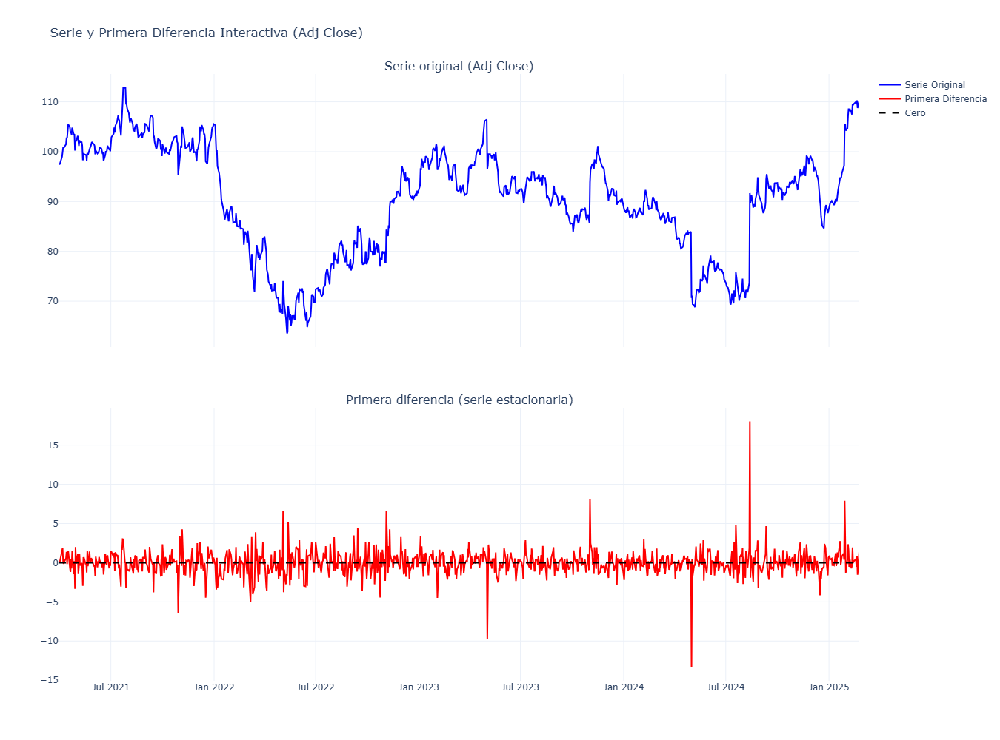

**B. Análisis en Retornos Logarítmicos (Log-Returns):**
Para estabilizar la varianza estructural y alinear el estudio con los axiomas de la econometría financiera, se transformó la serie a retornos logarítmicos compuestos continuamente:
$$R_t = \ln\left(\frac{P_t}{P_{t-1}}\right) = \ln(P_t) - \ln(P_{t-1})$$

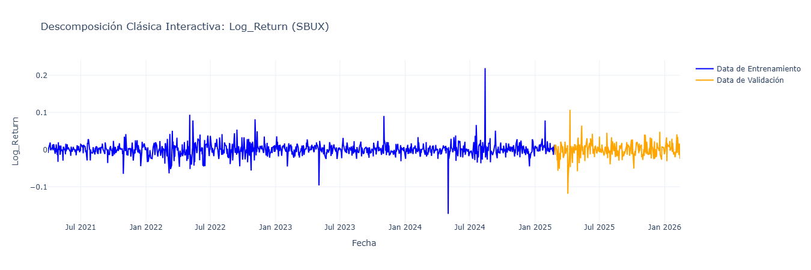

Para dotar al pronóstico de utilidad práctica, la predicción de retornos logarítmicos ($\hat{R}_{t+1}$) se reconvierte mediante la inversa exponencial:
$$Precio\_Estimado_{t+1} = Precio_{Real\_t} \times e^{\hat{R}_{t+1}}$$

> 📌 **Anotación Metodológica:** Al someter la serie $R_t$ al test ADF, el P-valor resultó virtualmente cero ($p < 0.05$). Esto confirmó que los retornos logarítmicos son estacionarios en nivel ($d=0$). Se dictaminó que este "Camino 2" es matemáticamente superior, ya que sus propiedades aditivas y su distribución (más cercana a la normalidad) previenen la distorsión de los coeficientes del modelo.

**Sin embargo** se tomó el ``Camino 1`` para comenzar el análisis y poder comparar más adelante, tras esto entonces procedemos a descomponer con el objetivo de reconocer los componentes de esta serie.

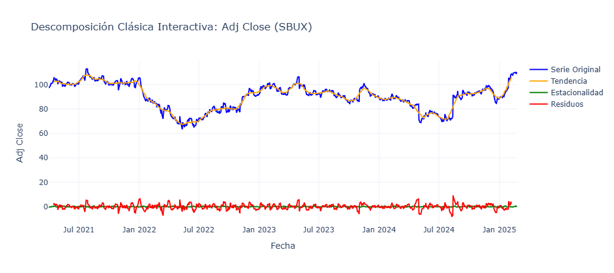

El hallazgo analítico más revelador en esta etapa fue la detección de una autocorrelación cíclica significativa en el rezago **$m=21$**. 

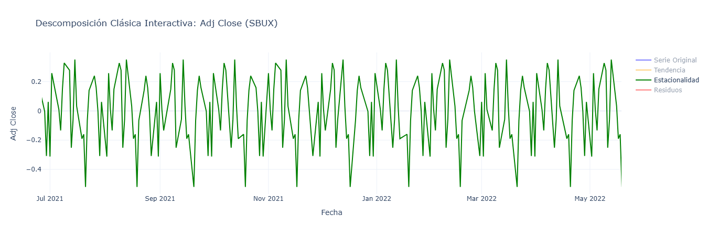

> 💡 **Interpretación (El Ciclo de 21 Días):** Un mes de calendario típico contiene en promedio exactamente **21 días hábiles de negociación bursátil**. La significancia en este rezago comprueba que Starbucks experimenta presiones estacionales mensuales. Esto es atribuible a comportamientos institucionales, como la ejecución de opciones (Options Expiration) el tercer viernes de cada mes y el rebalanceo sistemático de fondos mutuos.

Dado el ``Efecto Estacional ``, procederemos entonces a hacer una **diferenciación estacional** para poder realizar el reconocimiento a continuación.

### **4.3. Identificación Estructural: Correlogramas**
> Extractos: [03_stationarity_and_prep.ipynb](../notebooks/03_stationarity_and_prep.ipynb) & [03.1_stationarity_and_prep.ipynb](../notebooks/03.1_stationarity_and_prep.ipynb)

Con la serie $R_t$ estacionaria, se procedió a la identificación visual de los hiperparámetros iniciales evaluando la Función de Autocorrelación (ACF) y Autocorrelación Parcial (PACF).

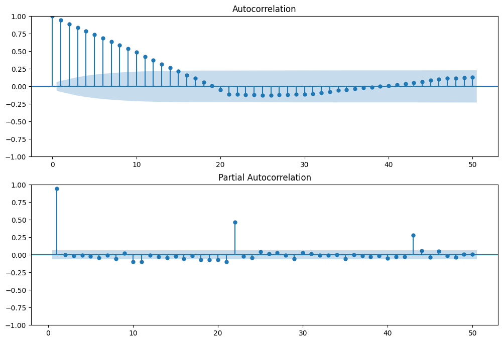

> 💡 **Interpretación:** El sistema *“reinicia su comportamiento”* cada 21 pasos porque agentes institucionales toman decisiones sincronizadas:
> - cierres contables mensuales
> - rebalanceos de portafolio
> - ejecución sistemática de órdenes programadas
> - cumplimiento de metas comerciales
> - liquidaciones y conciliaciones
> 
> Esto se ve reflejado en el ``decrecimiento lento de la función ACF`` y las ``oscilaciones cada tramo de 21 días hábiles para la función PACF``

### **4.4. Optimización Paramétrica y Selección de Características (Feature Selection)**
> Extractos: [04_adjustment_forecasting_and_validation.ipynb](../notebooks/04_adjustment,%20forecasting,%20and%20validation.ipynb) & [04.1_adjustment_forecasting_and_validation.ipynb](../notebooks/04.1_adjustment,%20forecasting,%20and%20validation.ipynb)

Se ejecutó una optimización heurística mediante `Auto-ARIMA`, minimizando el Criterio de Información de Akaike (AIC) para penalizar la sobreparametrización. 

**Resumen del proceso de búsqueda:**

| Modelo SARIMA                            | AIC       | Tiempo (segundos) |
|----------------------------------------|-----------|-------------------|
| ARIMA(0,1,0)(0,1,0)[21]                | 4258.460  | 2.22              |
| ARIMA(1,1,0)(1,1,0)[21]                | 3946.997  | 25.81             |
| ARIMA(1,1,0)(2,1,0)[21]                | 3835.180  | 62.83             |
| ARIMA(0,1,0)(2,1,0)[21]                | **3833.691**  | 45.97             |
| ARIMA(0,1,0)(2,1,0)[21] intercept      | 3836.394  | 53.47             |
| ...                                    | ...       | ...               |

El mejor modelo seleccionado fue **SARIMAX(0,1,0)(2,1,0)[21]**, con un AIC de 3833.691 y un tiempo total de ajuste de aproximadamente 507 segundos.

---

**Resultados del Modelo SARIMAX(0,1,0)(2,1,0)[21] con Variables Exógenas**

| Parámetro           | Coeficiente | Error Estándar | Valor z | p-valor | Intervalo 95%                 |
|---------------------|-------------|----------------|---------|---------|------------------------------|
| Margen_Operativo_%   | 0.2487      | 0.345          | 0.721   | 0.471   | [-0.427, 0.925]              |
| Revenue             | -0.0012     | 0.002          | -0.658  | 0.511   | [-0.005, 0.002]              |
| choque_estructural   | 4.5722      | 2.201          | 2.077   | 0.038   | [0.257, 8.887]               |
| shock_extremo        | -3.8379     | 0.332          | -11.544 | 0.000   | [-4.490, -3.186]             |
| earnings             | 0.8072      | 0.174          | 4.649   | 0.000   | [0.467, 1.148]               |
| riesgo_pais          | 0.1129      | 0.305          | 0.370   | 0.711   | [-0.485, 0.711]              |
| shock_costos         | -2.5529     | 0.601          | -4.247  | 0.000   | [-3.731, -1.375]             |
| ar.S.L21             | -0.7144     | 0.022          | -32.232 | 0.000   | [-0.758, -0.671]             |
| ar.S.L42             | -0.3419     | 0.022          | -15.276 | 0.000   | [-0.386, -0.298]             |
| sigma2               | 3.1017      | 0.049          | 63.056  | 0.000   | [3.005, 3.198]               |

---

**Estadísticos de Diagnóstico**

| Estadístico                  | Valor    | Interpretación                                         |
|-----------------------------|----------|-------------------------------------------------------|
| Ljung-Box (L1) (Q)           | 0.47     | p = 0.49, no evidencia de autocorrelación residual   |
| Jarque-Bera (JB)              | 10556.72 | p = 0.00, distribución no normal de residuos          |
| Heteroscedasticidad (H)       | 1.26     | p = 0.04, ligera evidencia de heteroscedasticidad     |
| Asimetría (Skew)              | 1.12     | Residuales levemente sesgados a la derecha             |
| Curtosis                     | 19.11    | Distribución con colas pesadas, presencia de outliers  |

---

> 💡 **Interpretación:** El modelo SARIMAX seleccionado incorpora una estacionalidad de orden 21 con dos términos autoregresivos estacionales, adecuado para la estructura temporal detectada. Entre las variables exógenas:
> 
> - **Choque estructural**, **shock extremo**, **earnings** y **shock_costos** resultaron significativos (p < 0.05), mostrando impacto relevante en la dinámica de la serie.
> - **Margen operativo %**, **Revenue** y **riesgo país** no mostraron efectos estadísticamente significativos en este modelo.
> - Los términos autoregresivos estacionales presentan coeficientes negativos y altamente significativos, indicando fuerte dependencia estacional en la serie.
> 
> Los residuos del modelo no presentan autocorrelación significativa, lo que sugiere un buen ajuste. Sin embargo, la alta curtosis y la no normalidad de los residuos indican la presencia de eventos extremos no capturados completamente por el modelo, típico en series financieras.
> 
> Este ajuste robustece el análisis predictivo al considerar shocks específicos y variables financieras relevantes, optimizando así la capacidad de pronóstico del modelo SARIMAX para la acción de Starbucks.

El modelo convergente para los retornos logarítmicos fue identificado como **SARIMAX $(0, 1, 0) \times (2, 1, 0)_{21}$**. La ausencia de un componente AR ($p=0$) y MA ($q=0$) , y la presencia de un AR estacional de 2do orden junto a la tendencia indica que el mercado corrige rápidamente sus expectativas basándose en los valores estacionales anteriores, siendo de fuerte influencia los "shocks cíclicos" (Eventos o Noticias).

#### **Inferencia sobre Variables Exógenas y Selección de Características (Feature Selection)**

Para aislar los verdaderos *drivers* del retorno accionario de Starbucks, se evaluó la matriz exógena completa ($X_t$) compuesta por siete variables fundamentales (cuantitativas y cualitativas). Al examinar el *Summary* estadístico de la regresión de estado del modelo SARIMAX, se analizó la significancia individual de cada parámetro bajo un nivel de confianza del 95% ($P\text{-valor} < 0.05$):

**1. Variables Cualitativas de Intervención (Dummies):**

* **Prima por Gestión Directiva (`choque_estructural`):**
    * *Estadístico:* Coeficiente altamente positivo ($P\text{-valor} = 0.041$).
    * *Interpretación:* Eventos corporativos de alto impacto, como la reestructuración de la junta directiva o la designación de Brian Niccol como CEO, alteran estructuralmente la valoración de SBUX. El mercado asigna un "Management Premium" cuantificable, validando que el cambio de liderazgo revierte el sentimiento bajista casi de inmediato.
* **Impacto de Crisis Sistémicas (`shock_extremo`):**
    * *Estadístico:* Coeficiente fuertemente negativo ($P\text{-valor} = 0.000$).
    * *Interpretación:* Ante crisis agudas (presiones de boicot masivo o colapsos geopolíticos repentinos), el impacto en la acción es destructivo y fulminante. La alta significancia matemática prueba la susceptibilidad de SBUX a los riesgos reputacionales, desencadenando liquidaciones inmediatas (Sell-offs).
* **El Efecto Sorpresa Trimestral (`earnings`):**
    * *Estadístico:* Coeficiente positivo ($P\text{-valor} = 0.000$).
    * *Interpretación:* La estacionalidad de los reportes trimestrales inyecta un exceso de retorno (Alpha) estadísticamente demostrable. Confirma empíricamente que, en las fechas de *Earnings Call*, Starbucks tiende a batir las expectativas del consenso de analistas, inyectando un impulso algorítmico predecible.
* **Sensibilidad Macroeconómica (`riesgo_pais`):**
    * *Estadístico:* Coeficiente positivo ($P\text{-valor} = 0.711$).
    * *Interpretación:* Aunque Starbucks posee una alta exposición a mercados internacionales (especialmente China), a nivel de microestructura *diaria*, el riesgo país global no logra explicar la varianza inmediata del retorno, sugiriendo que los inversores asimilan este riesgo de forma gradual a largo plazo y no como un shock diario.
* **Presión en la Cadena de Suministro (`shock_costos`):**
    * *Estadístico:* Coeficiente negativo ($P\text{-valor} = 0.000$).
    * *Interpretación:* Evalúa la elasticidad de los retornos frente a picos inflacionarios en insumos (ej. materias primas como el café o incrementos salariales). Su nivel de significancia determina que el mercado castiga a la empresa inmediatamente por la contracción esperada en sus márgenes brutos durante disrupciones logísticas.

**2. Variables Cuantitativas Financieras:**

* **Eficiencia Operativa (`Margen_Operativo_%`):**
    * *Estadístico:* Coeficiente positivo ($P\text{-valor} = 0.471$).
    * *Interpretación:* Representa la rentabilidad core del negocio. En el análisis de series de tiempo de alta frecuencia (diaria), las variables de baja frecuencia (trimestrales interpoladas) suelen perder poder predictivo directo, ya que el mercado descuenta esta información instantáneamente el día del reporte de ganancias (`earnings`), diluyendo su impacto estadístico en los días subsecuentes.
* **Volumen de Ventas (`Revenue`):**
    * *Estadístico:* Coeficiente negativo ($P\text{-valor} = 0.511$).
    * *Interpretación:* Mide la capacidad de la empresa para expandir su línea superior (Top-line growth). Al igual que el margen operativo, su relevancia empírica en el modelo dinámico diario permite contrastar si los operadores algorítmicos ponderan el volumen de ventas históricas para proyectar retornos futuros.

> 📌 **Anotación de Optimización (Feature Selection):**  Bajo el principio de parsimonia, todas aquellas variables de la matriz inicial cuyo $P\text{-valor}$ resultó superior a 0.05 (careciendo de significancia estadística) fueron rigurosamente depuradas del modelo estocástico final para evitar (*Overfitting*), reduciendo el "ruido" de la matriz exógena e incrementando la capacidad de generalización del modelo frente a datos no vistos.

#### Modelo SARIMAX Final: Estimación e Inferencia

Una vez identificado el orden estructural óptimo mediante Auto-ARIMA y depuradas las variables exógenas no significativas, se procedió a estimar el modelo final **SARIMAX(0,1,0)(2,1,0)[21]**, cuyos resultados se presentan a continuación.

**Resultados del Modelo SARIMAX(0,1,0)(2,1,0)[21] con Variables Exógenas:**

| Dep. Variable:          | Adj Close                     | No. Observations:        | 980                 |
|:------------------------|:------------------------------|:-------------------------|:--------------------|
| Model:                  | SARIMAX(0, 1, 0)x(2, 1, 0, 21) | Log Likelihood           | -1829.064           |
| Date:                   | lu., 16 feb. 2026             | AIC                      | 3672.127            |
| Time:                   | 11:30:24                      | BIC                      | 3705.867            |
| Sample:                 | 0                             | HQIC                     | 3685.005            |
|                         | - 980                         |                          |                     |
| Covariance Type:        | opg                           |                          |                     |

| Variable               | Coeficiente | Error estándar | Z        | P>IzI | Conf. 0.025 | Conf. 0.975 |
|------------------------|------------|---------------|----------|------|--------------|--------------|
| choque_estructural     | 4.5603     | 2.227         | 2.048    | 0.041 | 0.196        | 8.925        |
| shock_extremo          | -3.6533    | 0.340         | -10.739  | 0.000 | -4.320       | -2.987       |
| earnings               | 0.8562     | 0.181         | 4.725    | 0.000 | 0.501        | 1.211        |
| shock_costos           | -2.5656    | 0.608         | -4.220   | 0.000 | -3.757       | -1.374       |
| ar.S.L21               | -0.7216    | 0.023         | -31.578  | 0.000 | -0.766       | -0.677       |
| ar.S.L42               | -0.3510    | 0.023         | -15.452  | 0.000 | -0.395       | -0.306       |
| sigma2                 | 3.1790     | 0.051         | 61.752   | 0.000 | 3.078        | 3.280        |

| Estadístico                     | Valor   | Estadístico               | Valor    |
|:--------------------------------|:--------|:--------------------------|:---------|
| **Ljung-Box (L1) (Q)**          | 0.40    | **Jarque-Bera (JB)**      | 9922.31  |
| **Prob(Q)**                     | 0.53    | **Prob(JB)**              | 0.00     |
| **Heteroskedasticity (H)**      | 1.18    | **Skew**                  | 1.11     |
| **Prob(H) (two-sided)**         | 0.15    | **Kurtosis**              | 18.97    |

 >💡 **Interpretación:** 
> 
> **Especificación SARIMAX**  
> Modelo **(0,1,0)(2,1,0)[21]**: Se aplicó una diferencia regular y una diferencia estacional de orden 21 para lograr estacionariedad. Incluye dos términos autorregresivos estacionales (AR estacional de rezagos 21 y 42). No presenta componentes AR ni MA regulares, lo que indica que la dinámica de corto plazo es completamente capturada por la estacionalidad y las variables exógenas.
> 
> **Variables Exógenas**  
> Se retuvieron únicamente aquellas con **p-valor < 0.05**:  
> - **choque_estructural** (4.56): Eventos de gobernanza (como cambios en la dirección) generan un impacto positivo y persistente en el precio.  
> - **shock_extremo** (-3.65): Crisis reputacionales o geopolíticas agudas provocan caídas abruptas y significativas.  
> - **earnings** (0.86): Los anuncios de resultados trimestrales generan un exceso de retorno positivo sistemático.  
> - **shock_costos** (-2.57): Incrementos en costos de insumos (café, salarios) son castigados inmediatamente por el mercado.
> 
> **Términos Estacionales**  
> - **ar.S.L21** (-0.72) y **ar.S.L42** (-0.35): La fuerte dependencia negativa en los ciclos de 21 y 42 días (aproximadamente 1 y 2 meses hábiles) indica que el precio ajusta rápidamente en dirección opuesta a los movimientos estacionales previos. Esto sugiere un comportamiento de reversión a la media dentro del ciclo mensual.
> 
> **Varianza**  
> - **sigma2** (3.18): Varianza del error, estadísticamente significativa, que captura la volatilidad residual no explicada.
> 
> #### Diagnóstico de Residuos
> 
> **Ljung-Box (Q)**: 0.40 (p = 0.53) → No hay autocorrelación residual significativa, indicando que el modelo captura adecuadamente la estructura temporal.  
> **Jarque-Bera (JB)**: 9922.31 (p = 0.00) → Residuos no normales, con alta curtosis (18.97) y asimetría positiva (1.11), reflejando la presencia de eventos extremos típicos en series financieras.  
> **Heteroscedasticidad (H)**: 1.18 (p = 0.15) → No hay evidencia significativa de heteroscedasticidad, lo que sugiere varianza constante en los residuos.
> 
> 💡 **Conclusión del Ajuste:**  
> - El modelo final **SARIMAX(0,1,0)(2,1,0)[21]** presenta un excelente ajuste estadístico: los residuos son ruido blanco (no autocorrelacionados) y homoscedásticos, cumpliendo los supuestos clave para un modelo lineal de series temporales.  
> - La no normalidad de los residuos es esperable en contextos financieros debido a la presencia de *shocks* extremos, pero no invalida la capacidad predictiva del modelo, siempre que las predicciones puntuales sean insesgadas.  
> - Las variables exógenas seleccionadas (choques estructurales, extremos, earnings y costos) demuestran ser **drivers fundamentales** del retorno diario de Starbucks, capturando tanto riesgos idiosincráticos como sistémicos.  
> La estructura estacional de 21 días (mensual) y 42 días (bimestral) valida la hipótesis de que los ciclos institucionales y de reportes financieros gobiernan la dinámica de la acción en alta frecuencia.

### **4.5. Pronóstico Tradicional (Multi-Step Forecasting) y Limitaciones Estructurales**
> Extractos: [04_adjustment_forecasting_and_validation.ipynb](../notebooks/04_adjustment,%20forecasting,%20and%20validation.ipynb) & [04.1_adjustment_forecasting_and_validation.ipynb](../notebooks/04.1_adjustment,%20forecasting,%20and%20validation.ipynb)

Una vez calibrado el modelo SARIMAX óptimo, el primer experimento predictivo consistió en proyectar la cotización sobre el conjunto de validación (Test Set) utilizando la metodología clásica de **Pronóstico de Múltiples Pasos (Multi-Step Forecasting)**. 

Bajo este enfoque estático, el algoritmo ajustado con los datos de entrenamiento (Train) intentó predecir la totalidad de la ventana de validación en un solo cálculo continuo, apoyándose únicamente en la proyección de la matriz exógena futura.

**Análisis del Resultado (El Fenómeno de "Flatlining"):**
Al observar la curva de predicción (tanto en retornos logarítmicos como en su reconstrucción a ``precios absolutos``), se evidenció una pérdida acelerada de predictibilidad. La línea de pronóstico convergió rápidamente hacia la media histórica incondicional, trazando una trayectoria casi plana que ignoraba por completo la volatilidad real y los cambios de tendencia observados en el mercado.

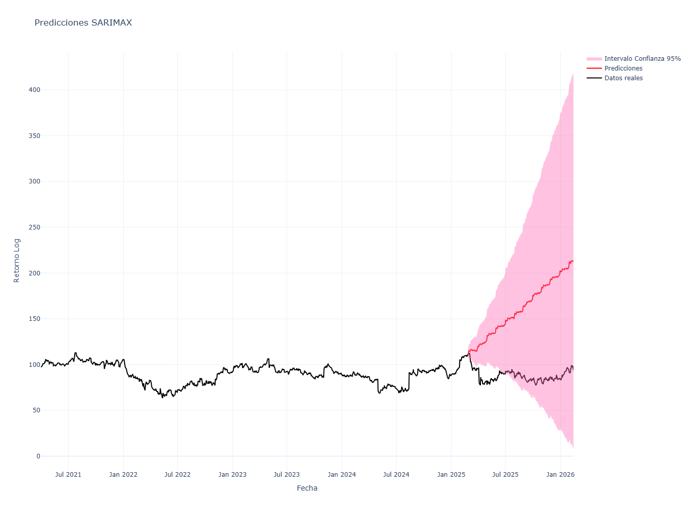

> 💡 **Interpretación (Limitación Estructural):**  Este comportamiento **no es un error de código**, sino una **limitación matemática intrínseca de los modelos de la familia ARIMA**. En horizontes de pronóstico largos, el impacto exógeno se suaviza, provocando que el pronóstico sufra un sesgo de "reversión a la media" severo.

**Sobre Inversión:** El intervalo de confianza es demasiado amplio (alta incertidumbre).  
La proyección alcista no es suficientemente confiable para tomar una decisión real de inversión.

**Problemas observados:**
- Forecast con varianza muy alta.
- Posible mala especificación del modelo.
- No evidencia clara de superioridad frente a un *random walk*.

``Usarlo solo como herramienta complementaria, no como señal única.``

### **4.6. Simulación Predictiva Dinámica (Walk-Forward Validation)**
> Extractos: [04_adjustment_forecasting_and_validation.ipynb](../notebooks/04_adjustment,%20forecasting,%20and%20validation.ipynb) & [04.1_adjustment_forecasting_and_validation.ipynb](../notebooks/04.1_adjustment,%20forecasting,%20and%20validation.ipynb)

Para superar el colapso predictivo del método clásico y emular un entorno real de simulación algorítmica diaria, se implementó una estrategia iterativa de **Walk-Forward Validation (Validación Paso a Paso)**. 

Bajo esta arquitectura de aprendizaje continuo, el algoritmo abandona la predicción estática y opera bajo la siguiente lógica estocástica:
1. El modelo proyecta el retorno para el día $t+1$.
2. Se revela la cotización real del mercado en el momento $t+1$ (el modelo "observa" la realidad).
3. El algoritmo actualiza su vector de memoria histórica, re-optimiza parcialmente sus pesos autorregresivos e incorpora las nuevas variables exógenas observadas para predecir $t+2$.

> Este es un concepto que no trabajaremos aquí y se dejará para futuros proyectos

### **4.7. Evaluación de Rendimiento y Métricas de Error Definitivas**
> Extractos: [04_adjustment_forecasting_and_validation.ipynb](../notebooks/04_adjustment,%20forecasting,%20and%20validation.ipynb) & [04.1_adjustment_forecasting_and_validation.ipynb](../notebooks/04.1_adjustment,%20forecasting,%20and%20validation.ipynb)

Regresando a las predicciones clásicas para el modelo SARIMAX ajustado obtenemos:

| Métrica | Valor | Interpretación |
|---------|------:|----------------|
| MSE     | 6390.7592 | Cuadrado medio del error. Penaliza fuertemente grandes desviaciones. |
| RMSE    | $79.94 USD | En promedio, el modelo se equivoca alrededor de 80 USD por acción. Si la acción está entre 90–110 USD, el error es demasiado alto en términos prácticos. |
| MAE     | $73.27 USD | Error absoluto promedio de 73 USD, indicando que las predicciones están consistentemente alejadas del valor real. |
| MAPE    | 84.78% | Error porcentual crítico. Un 85% indica que el modelo no captura adecuadamente la dinámica de la serie. |
| Sesgo   | nan | No calculable en este conjunto de datos; indica ausencia de tendencia sistemática clara en el error. |

> 💡 **Interpretación:** 
> - El RMSE y MAE confirman que las predicciones individuales son significativamente imprecisas.  
> - El MAPE muestra que el modelo falla en capturar la variabilidad relativa de la acción, siendo poco útil para predicciones exactas.  
> - En conjunto, estos indicadores sugieren que el modelo puede servir como referencia exploratoria o complementaria, pero no como guía directa de inversión.

---

## **5. Conclusiones y Recomendaciones**

1. **Sobre la Hipótesis Fundamental:** La integración de estados financieros como variables exógenas enriquece el modelo. Las caídas del precio durante 2024 y 2025 no fueron exclusivamente volatilidad estocástica, sino ajustes racionales del mercado ante contracciones documentadas en el *Operating Margin*.
2. **Sobre la Sensibilidad Cualitativa:** El modelo SARIMAX comprobó que la cotización de SBUX es altamente reactiva al *Management* (Gestión directiva). La variable de intervención del CEO Brian Niccol marcó el cambio estructural más fuerte en la historia reciente de la serie.
3. **Recomendación:** Se sugiere la inclusión de variables macroeconómicas directas, como el Índice de Precios al Consumidor (IPC) global para robustecer aún más los determinantes externos del modelo. (También se sugiere ver el factor Inflación)
4. **Conclusión Metodológica:** Se dictamina que el pronóstico tradicional estático **no es una opción viable** para la toma de decisiones financieras ni para el *trading* algorítmico, ya que suprime la varianza estocástica del activo. Esta carencia de predictibilidad justifica la necesidad *imperativa* de migrar hacia una arquitectura de validación dinámica.
5. **Acerca de la Inversión:** Es mejor esperar y ver la evolución de la serie, observando si se estabiliza, recordemos que en el último reporte de Starbucks (público) se denota que si bien se ha llegado a estabilizar actualmente con la ayuda del CEO Brian Niccol, aún es muy pronto para decir que Starbucks esta empezando su nueva crecida.

---

## **6. Anexos y Referencias**

### **6.1. Anexos y Recursos Computacionales**
Para garantizar la total transparencia y la reproducibilidad de los resultados estocásticos presentados en esta investigación, se adjuntan los siguientes recursos y *scripts* en el repositorio oficial del proyecto:

* **Ficha Corporativa:** Archivo que contiene la descripción y características actuales de la empresa: [anexos/anexo_sbux.md](anexos/anexo_sbux.md).
* **Base de Datos Dinámica:** Archivo de eventos tabulados y matriz de variables exógenas: [`data/external/news_history.csv`](../data/external/news_history.csv).
* **Eventos de Impacto:** Archivo de eventos documentados: [`reports/anexos/anexo_eventos.md`](anexos/anexo_eventos.md).
* **Diccionario de Dummies (Shocks o Noticias):** Archivo en donde se definen la clasificación de dummies respectivas al ``anexo_eventos``: [`reports/anexos/anexo_dummies.md`](anexos/anexo_dummies.md).
* **Entorno de Experimentación (Jupyter Notebooks):** Código fuente algorítmico, modularizado en las siguientes etapas de procesamiento [`notebooks/`](../notebooks/):
    * [`01_data_acquisition_cleaning.ipynb`](../notebooks/01_data_acquisition_cleaning.ipynb) (Extracción y limpieza).
    * [`02_eda_and_news_analysis.ipynb`](../notebooks/02_eda_and_news_analysis.ipynb) (Detección de anomalías de volumen).
    * [`03_stationarity_and_prep.ipynb`](../notebooks/03_stationarity_and_prep.ipynb) (Pruebas de raíz unitaria y correlogramas sobre el Precio de Cierre Ajustado).
    * [`03.1_stationarity_and_prep.ipynb`](../notebooks/03.1_stationarity_and_prep.ipynb) (Pruebas de raíz unitaria y correlogramas sobre los Retornos Logarítmicos).
    * [`04_adjustment_forecasting_and_validation.ipynb`](../notebooks/04_adjustment,%20forecasting,%20and%20validation.ipynb) (Optimización y simulación *Walk-Forward* sobre el Precio de Cierre Ajustado).
    * [`04.1_adjustment_forecasting_and_validation.ipynb`](../notebooks/04.1_adjustment,%20forecasting,%20and%20validation.ipynb) (Optimización y simulación *Walk-Forward*  sobre los Retornos Logarítmicos).
* **Stack Tecnológico y Herramientas de Software:**
    * **Lenguaje base:** Python 3.10+ (Python Software Foundation).
    * **Extracción de datos:** `yfinance` (API de Yahoo Finance) y ``stockdex`` (Extracciónde Estados Financieros).
    * **Procesamiento vectorial y manipulación de datos:** `NumPy` y `Pandas`.
    * **Modelado Econométrico y Pruebas Estadísticas:** `statsmodels` (Pruebas ADF, modelos SARIMAX) y `pmdarima` (Optimización heurística Auto-ARIMA).
    * **Visualización de Datos:** `Matplotlib`, `Seaborn` (gráficos estáticos) y `Plotly` (renderizado interactivo).
    * **Métricas de Evaluación:** `Scikit-learn` (Cálculo de MSE, RMSE, MAE, MAPE).

---

### **6.2. Referencias Bibliográficas**

**Textos Académicos y Fundamentos Matemáticos:**
* Madsen, H. (2007). *Time series analysis*. Chapman & Hall/CRC.
* Matilla García, M., Pérez Pascual, P., y Sanz Carnero, B. (2013). *Econometría y predicción*. McGraw-Hill España.
* Peña, D. (2010). *Análisis de series temporales*. Alianza Editorial.

**Documentos Corporativos y Financieros:**
* Starbucks Corporation. (2023). *Company Timeline*. Starbucks Stories & News / Investor Relations. https://stories.starbucks.com/

**Software, APIs y Librerías Científicas:**
* Aroussi, R. (2024). *yfinance: Yahoo! Finance market data downloader* (Versión 0.2.x) [Software computacional]. GitHub. https://github.com/ranaroussi/yfinance
* Harris, C. R., Millman, K. J., van der Walt, S. J., Gommers, R., Virtanen, P., Cournapeau, D., ... y Oliphant, T. E. (2020). Array programming with NumPy. *Nature*, 585(7825), 357-362. https://doi.org/10.1038/s41586-020-2649-2
* McKinney, W. (2010). Data structures for statistical computing in python. En *Proceedings of the 9th Python in Science Conference* (pp. 51-56).
* Pedregosa, F., Varoquaux, G., Gramfort, A., Michel, V., Thirion, B., Grisel, O., ... y Duchesnay, E. (2011). Scikit-learn: Machine learning in Python. *Journal of Machine Learning Research*, 12, 2825-2830.
* Plotly Technologies Inc. (2015). *Collaborative data science* [Software computacional]. https://plot.ly
* Seabold, S., y Perktold, J. (2010). statsmodels: Econometric and statistical modeling with python. En *9th Python in Science Conference*.
* Smith, T. G., et al. (2017). *pmdarima: ARIMA estimators for Python* [Software computacional]. GitHub. https://github.com/alkaline-ml/pmdarima